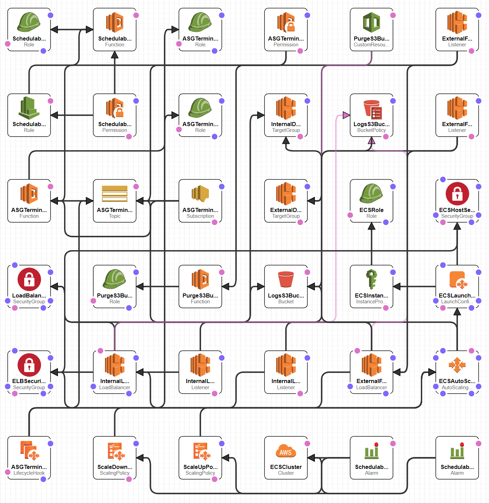
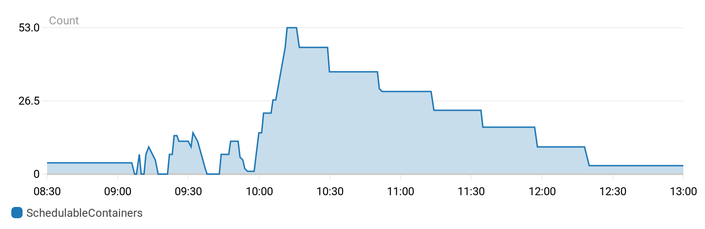
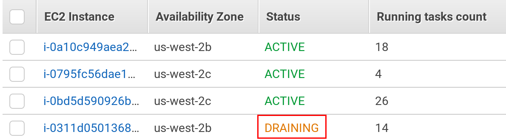

# ECS Cluster Pipeline

- [Introduction](#introduction)
- [Pipeline Usage](#pipeline-usage)
- [General Design](#general-design)
- [Architecture](#architecture)
- [Instance Autoscaling that Works](#instance-autoscaling-that-works)
- [Scaling down the Cluster Without Affecting End Users](#scaling-down-the-cluster-without-affecting-end-users)
- [IAM Roles](#iam-roles)
- [cloudformation-exports](#cloudformation-exports)
- [Tagging Compliance](#tagging-compliance)
- [Application Load Balancers (ALBs)](#application-load-balancers-albs)
- [Start a Task on Each ECS Instance](#start-a-task-on-each-ecs-instance)
- [CloudFormation Template](#cloudformation-template)

## Introduction

As more application services migrate to the AWS cloud, a pattern quickly emerges in which EC2 resources are considerably underutilized. While a wide array of EC2 instance types and autoscaling options help to match the consumed infrastructure with current demand, many services still make little use of the available memory, CPU, or bandwidth. In order to make better use of available resources, AWS provides Elastic Container Service (ECS), which enables multiple services to run on a single set of EC2 instances.

## Pipeline Usage

With _spicy-automation_ added as a global library you can setup a "my-stack-name-ecs" as a repo. Add a Jenkinsfile to your repo with the following content:

```bash
#!/usr/bin/env groovy

@Library(["spicy-automation@development"]) _

spicyECSCluster(
    devAccount: accounts.get().<accountName>_<region>_<env>, // e.g. devAccount: accounts.get().SPICY_US_EAST_1_DEV,
    sandboxAccount: accounts.get().<accountName>_<region>_<env>,
    stagingAccount: accounts.get().<accountName>_<region>_<env>,
    prodAccount: accounts.get().<accountName>_<region>_<env>,
    stackName: "<stackName>"
)
```

The following defaults are assumed and can be overridden:

```yaml
containerInsights: enabled
minClusterSize: 2
maxClusterSize: 4
maxBatchSize: 1
largestContainerCpuReservation: 1024
largestContainerMemoryReservation: 4096
clusterScaleUpAdjustment: 1
clusterScaleUpAdjustmentType: ChangeInCapacity
clusterScaleUpCooldown: 60
clusterScaleUpMins: 2
clusterScaleUpThreshold: 1
clusterScaleDownAdjustment: -1
clusterScaleDownAdjustmentType: ChangeInCapacity
clusterScaleDownCooldown: 300
clusterScaleDownMins: 30
additonalEc2SecurityGroups: ""
externalElbSecurityGroups: ""
ebsVolumeSize: 300
createExternalFacingLoadBalancer: false
createInternalLoadBalancer: false
logsS3BucketName: ""
purgeS3LogsOnStackDelete: false
asgTerminateTimeout: 900
containerDeviceManagerSize: 10
externalFacingLoadBalancerIdleTimeout: 60
internalLoadBalancerIdleTimeout: 60
userDataVersion: 1
task1ToStartOnAllInstances: "-"
vpcExternalSubnets: "${account.publicSubnetA},${account.publicSubnetB},${account.publicSubnetC},${account.publicSubnetD}"
// if UseACLSubnets is false (default)
vpcInternalSubnets: "${account.privateSubnetA1},${account.privateSubnetB1},${account.privateSubnetC1},${account.privateSubnetD1}"
// if UseACLSubnets is true
vpcInternalSubnets: "${account.privateSubnetA2},${account.privateSubnetB2},${account.privateSubnetC2},${account.privateSubnetD2}"
```

## General Design

The general idea around the ECS cluster is to promote durability, scaling and security. The following key points are taking into place:

- Cluster defaults to having only internal load balancers
  - If you know you will launch public items (using the cluster ALB) then turn public LB's on
- Reource drainging lifecycle hook that on scale-in events of the cluster will mark tasks and instances as draining to prevent 5XX errors
- Scaling lifecycle hook via custom cloudformation metric which generates a metric to know who many containers can be placed on a given instance given it's ram/cpu and the max ram/cpu allowed on the cluster
- **_IN_PROGRESS_** Integrated with [autospotting](https://github.com/cristim/autospotting) to save up to 80% of cost in non-production environments.

## Architecture



## Instance Autoscaling that Works

Anyone that has ran multiple applications inside a single ECS cluster has most likely encountered this error:

    service X was unable to place a task because no container instance met all of its requirements

The desired instance count of the EC2 autoscaling group would be below the maximum instance count but the ECS scheduler is not aware of this. ECS provides CloudWatch metrics about the overall CPU and memory reservation inside the cluster, however ECS currently does not provide metrics about the number of pending tasks. Setting the scale up and scale down policy based on multiple CloudWatch metrics can be problematic since there can be conflicts if one metric says to scale up but the other metric says to scale down.

The method described at http://garbe.io/blog/2017/04/12/a-better-solution-to-ecs-autoscaling/ provides a solution to this problem. That blog post provides a Lambda function that publishes a custom CloudWatch metric called SchedulableContainers. The Lambda function needs to know the largest CPU and memory reservation that can be requested inside your cluster so that it can calculate how many of the largest containers can be started. The instance autoscaling is configured to only use this metric. In essence, this means that the cluster will always have available Capacity for one additional instance of the largest task.

The Lambda function is included inline in the CloudFormation template.


_An ECS service was started with 500 idle containers. The number of EC2 instances in the cluster automatically scaled up from 2 to 8 to handle running that many containers. Once everything was stable, the ECS service was manually removed from the cluster and the number of instances automatically scaled back down to 2. The cluster can be configured to scale up more aggressively if needed._



_The SchedulableContainers CloudWatch metric that corresponds to the instance autoscaling graph from above. Notice that the number of SchedulableContainers goes up to 53 once the ECS service with 500 containers was removed and that is what triggers the instance autoscaling to slowly remove instances._

## Scaling down the Cluster Without Affecting End Users

When an ECS cluster scales down, your applications will likely see intermittent 50X errors
from the ALB when an instance is taken out of service. This is caused by AWS AutoScaling
not being aware of the ECS containers running on the instance that is terminated, so the
instance is shutting down while it is currently serving traffic. Ideally, the instance
should stop receiving traffic prior to shutting down.

AWS AutoScaling supports [lifecycle hooks](https://docs.aws.amazon.com/autoscaling/ec2/userguide/lifecycle-hooks.html)
to notify a Lambda function when an instance is about to be terminated. AWS Support recommends the Lambda function [here](#https://aws.amazon.com/blogs/compute/how-to-automate-container-instance-draining-in-amazon-ecs/) to gracefully drain the ECS tasks before the instance is terminated. The version provided by AWS has several issues and a rewritten version is provided inline in the ECS cluster template with the following changes:

- The AWS code can post messages to the wrong SNS topic when retrying. It looks for the first SNS topic in the account that has a lambda function subscribed to it and posts the retry message to that topic.
- The AWS code does not do any kind of pagination against the ECS API when reading the list of EC2 instances. So if it couldn't find the instance ID that was about to be terminated on the first page, then the instance was not set to DRAINING and the end users would see 50X messages when the operation timed out and autoscaling killed the instance.
- The retry logic did not put in any kind of delay in place when retrying. The Lambda function would be invoked about 5-10 times a second, and each Lambda function invocation would probably make close to a dozen AWS API calls. A 5 second delay between each retry was introduced.
- There was a large amount of unused code and variables in the AWS implementation.
- Converted the code from Python 2 to 3.
- Previously, the old Lambda function was included as a separate 8.1 MB ZIP file that needed to be stored at S3 and managed separately from the rest of your ECS cluster. Python code in AWS Lambda no longer needs to bundle all of its dependencies . With all of the refactoring above, the new Python code is small enough that it is embedded directly in the CloudFormation template to reduce external dependencies. This will make it easy to make changes to this code on a branch and test it against a single ECS cluster.

Other container schedulers, such as Kubernetes, will have the same issue and the same approach can be used to drain pods.



_The cluster has an improved autodraining Lambda that integrates with AWS AutoScaling to drain containers during scale-down events which will avoid any unexpected 50X errors returned to the end users._

## IAM Roles

[Task-based IAM roles](https://docs.aws.amazon.com/AmazonECS/latest/developerguide/task-iam-roles.html) are implemented so that the cluster doesn't need to run with the permissions of all applications running inside it.

The ECS cluster itself needs some IAM roles configured for its proper operation and the provided CloudFormation template uses the AWS-managed IAM roles when available so that the clusters automatically get the required IAM permissions as new AWS features are made available in the future.

```yaml
ECSRole:
  Type: AWS::IAM::Role
  Properties:
    ManagedPolicyArns:
      - arn:aws:iam::aws:policy/service-role/AmazonEC2ContainerServiceforEC2Role
```

## CloudFormation Exports

After your ECS cluster is setup, you will need to know some duplicate information such as VPC IDs, load balancer information, etc when setting up your ECS services. We use [CloudFormation exports](https://docs.aws.amazon.com/AWSCloudFormation/latest/UserGuide/using-cfn-stack-exports.html) so that the service can look up all of this information from the ECS cluster CloudFormation stack. When setting up a new ECS service via CloudFormation, we only need to know 1) the AWS region, 2) the CloudFormation stack name that has our ECS cluster, and 3) which shared load
balancer to attach to (internet-facing or internal and only if we are deploying using the cluster ALBs. The default deployment is to use isolated load balancers). The ECS service can lookup the VPC that the cluster is in with the CloudFormation snippet `'Fn::ImportValue': "cluster-stack-name-VPC"`. This reduces the number of parameters that our ECS services need to have.

## Tagging Compliance

All taggable AWS resources must have the `owner`, `product`, `component`, and `environment` tags present. We use the equivalent of `aws cloudformation create-stack --tags ...` to provision our CloudFormation stacks so that all taggable AWS resources will get the proper tags. There are two exceptions in the ECS cluster template:

- The EC2 AutoScaling group will get the tags, however `PropagateAtLaunch: true` will not be set so the EC2 instances that are started will not get the proper tags. These four tags are explicitly configured on the AutoScaling group so that the EC2 instances are tagged properly.
- The EBS volumes associated with the EC2 instances do not inherit the tags of the EC2 instance. On startup, each EC2 instance takes care of adding the appropriate tags to its EBS volumes.

## Application Load Balancers (ALBs)

The ECS cluster template allows you to create an internet-facing and an internal load balancer to allow easily running multiple applications inside the same cluster. One or both of the load balancers can be disabled via CloudFormation parameters if desired. Be aware that the ALB [currently has a limit of 100 listener rules per load balancer](https://docs.aws.amazon.com/elasticloadbalancing/latest/application/load-balancer-limits.html).

With that in mind it's best to use the ALBs on the cluster for cluster critical tasks that should be more globalized. The ECS Pipeline individually deploys it's own ALB's for each service thus negatating this limit.

A dedicated S3 bucket is created for the cluster to store the ALB access logs.

## Start a Task on Each ECS Instance

ECS currently does not have the ability to start a task on each instance inside the cluster. To work around this, each EC2 instance has the ability to start a task that will run only on the current instance using the parameter:

```yaml
Task1ToStartOnAllInstances:
  Description: Initial container arn instance to start on all instances
  Type: String
  Default: '-'
```

## CloudFormation Template

By following these best practices and techniques, ECS can significantly lower infrastructure costs and simplify scaling, deployment, and management concerns. A fully functional CloudFormation template which implements all of these best practices can be [downloaded here](../resources/ansible/playbooks/cloudformation/ecs-cluster.yml).
