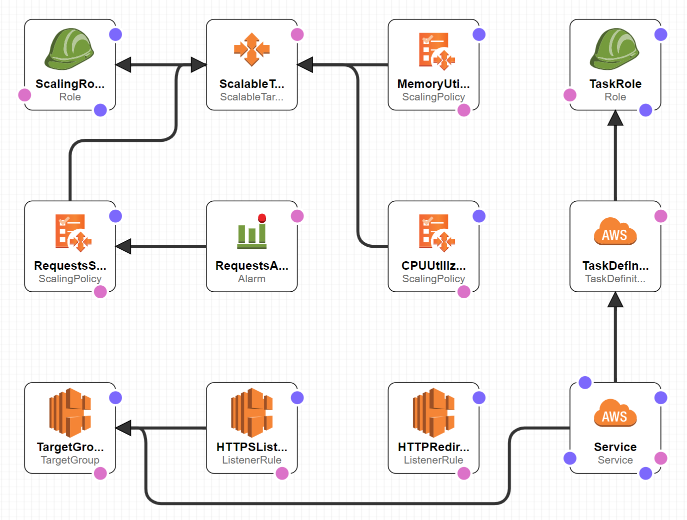
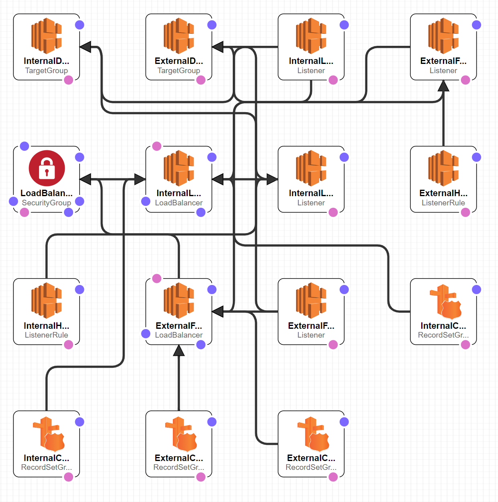

# ECS Service Pipeline

- [Pipeline Usage](#pipeline-usage)
- [Service Architecture](#service-architecture)
- [Common Architecture](#common-architecture)
- [Secrets](#secrets)
- [Canary Deployments](#canary-deployments)
- [Blue / Green Deployments](#bluegreen-deployments)
  - [Initial State](#initial-state)
  - [Deploy V2 to Green Service](#deploy-v2-to-green-service)
  - [Update hostname of Green Service](#update-hostname-of-green-service)
  - [Mark Blue ECS Service as Inactive](#mark-blue-ecs-service-as-inactive)
- [Rolling Back a Bad Deployment](#rolling-back-a-bad-deployment)
- [CloudFormation Templates](#cloudformation-templates)

## Pipeline Usage

With _spicy-automation_ added as a global library you can setup a "my-service-name" as a repo. Add a Jenkinsfile to your repo with the following content:

```bash
#!/usr/bin/env groovy

@Library(["spicy-automation@development"]) _

def serviceName = "<serviceName>";

spicyECSService(
  // account used for publishing/building docker images
  account: accounts.get().<accountName>_<region>, // e.g. devAccount: accounts.get().SPICY_US_EAST_1,
  // buildCommand: { Map args ->
  //   sh "jenkins-hooks/build.sh ${dockerUtils.getContainerName(serviceName: serviceName)}"
  // },
  // this defaults to main; but if you need to override for testing in a PR
  // branch name is supplied PER environment
  // devDeploymentBranch: "branch-name",
  // deployment accounts
  devAccount: accounts.get().<accountName>_<region>_<env>, // e.g. devAccount: accounts.get().SPICY_US_EAST_1_DEV,
  // sandboxAccount: accounts.get().<accountName>_<region>_<env>,
  // stagingAccount: accounts.get().<accountName>_<region>_<env>,
  // prodAccount: accounts.get().<accountName>_<region>_<env>,
  serviceName: serviceName,
  clusterName: "<clusterName>"
)
```

You will need to define a few files under a `deployment` folder inside the repo.

### Dockerun.aws.yml

This defines the containers that make up your service and how they link together.

```yaml
ContainerDefinitions:
  - Name: '{{ containerName }}' # pipeline generated
    Image: '{{ ecrImageId }}' # pipeline generated
    Ulimits:
      - Name: nofile
        SoftLimit: 4096
        HardLimit: 4096
    Cpu: '{{ cpu }}' # template default available, user can override
    Memory: '{{ memory }}' # template default available, user can override
    Secrets:
      - Name: NEW_RELIC_LICENSE_KEY
        ValueFrom: '{{ newRelicLicenseKey }}' # user defined
    Environment:
      - Name: NODE_ENV
        Value: '{{ nodeEnv }}' # user defined
      - Name: NODE_CONFIG_ENV
        Value: '{{ nodeConfigEnv }}' # user defined
      - Name: BUILD
        Value: '{{ build }}' # pipeline defined
      - Name: CHANGE_BRANCH
        Value: '{{ changeBranch }}' # pipeline defined
      - Name: BRANCH_NAME
        Value: '{{ branchName }}' # pipeline defined
    PortMappings:
      - ContainerPort: '{{ containerPort }}' # template default available, user can override
```

### iam-policy.yml

This is to define the policies which are required in order for you containers to do there job. In this example containers should be able to push log events, and get/decrypt secret values from `AWS Secrets Manager` so they are not required to be in-code.

```yaml
Version: 2012-10-17
Statement:
  - Effect: Allow
    Action:
      - ecr:GetAuthorizationToken
      - ecr:BatchCheckLayerAvailability
      - ecr:GetDownloadUrlForLayer
      - ecr:BatchGetImage
      - logs:CreateLogStream
      - logs:PutLogEvents
    Resource: '*'
  - Effect: Allow
    Action:
      - kms:Decrypt
      - secretsmanager:GetSecretValue
      - ssm:GetParametersByPath
      - ssm:GetParameters
      - ssm:GetParamete
    Resource:
      - 'arn:aws:kms:*:{{ accountId }}:key/*' # accountId pipeline defined
      - 'arn:aws:secretsmanager:*:{{ accountId }}:secret:*' # accountId pipeline defined
      - 'arn:aws:ssm:*:{{ accountId }}:parameter/*' # accountId pipeline defined
```

### vars.common.yml

Commong vars are shared across all environment files and setup base variables and replacements.

```yaml
# tagging
ownerTag: SpicyTeam
productTag: spicy
componentTag: spicy-FrontEndUIServices
# service
healthCheckUrl: /api/ping
# desiredCount: 2
# minSAacity: 2
# maxSAacity: 4
# cpu: 256
# memory: 512
# containerPort: 3000
newRelicLicenseKey: arn:aws:secretsmanager:us-east-1:<accountId>:secret:SECRET_NAME
# bg-common
# additonalEc2SecurityGroups: ""
# externalElbSecurityGroups: ""
# externalFacingLoadBalancerIdleTimeout: 60
# internalLoadBalancerIdleTimeout: 60
# vpcExternalSubnets: ""
# vpcInternalSubnets: ""
```

### vars.\<env\>.yml

Environment files override the common files and extend them further.

```yaml
# service
nodeEnv: development
nodeConfigEnv: development
# service & bg-common
hostName: spicy-ui-services.development.web.spicy.com
```

### vars.production.yml `override example`

As a sample; production requires bigger requirements and resources to run effectively.

```yaml
# service
nodeEnv: production
nodeConfigEnv: production
desiredCount: 4
minSAacity: 4
maxSAacity: 24
cpu: 1024
memory: 2048
# service & bg-common
hostName: spicy-ui-services.production.web.spicy.com
```

## Service Architecture



## Secrets

Secrets are stored in [AWS Secrets Manager](https://console.aws.amazon.com/secretsmanager/home?region=us-east-1#/listSecrets). They are pulled into the pipeline and via vars.x.yml files and injected automatically.

Secrets from [AWS Secrets Manager](https://console.aws.amazon.com/secretsmanager/home?region=us-east-1#/listSecrets) are stored as strings when they get pulled into environment variables. You can either store JSON KVP or plaintext but ultimately it will be coming into the environment as a string. Parsing it will be required if stored as JSON.

### Adding Secrets

Here are the steps to add a secret (overall) and then detailed steps.

- add secret in [AWS Secrets Manager](https://console.aws.amazon.com/secretsmanager/home?region=us-east-1#/listSecrets)
  - it's for text base ones to use the `plaintext` tab, delete everything and paste the "value" into there
  - for kvp use the `secret key/value` tab
  - the secret type is `Other types of secrets`
  - name it something like `<envName>/<serviceOrProductName>/<secretName>`
    - e.g. env specific: `prod/spicy-services/oauth-client-id`, `dev/spicy-services/oauth-client-secret`
    - e.g. shared in all env: `NEW_RELIC_LICENSE_KEY`
    - more examples of secret types:
      - [plaintext](https://console.aws.amazon.com/secretsmanager/home?region=us-east-1#/secret?name=NEW_RELIC_LICENSE_KEY) click `retrieve secret value`
      - [secret key/value](https://console.aws.amazon.com/secretsmanager/home?region=us-east-1#/secret?name=SPICY_SECRET) click `retrieve secret value`
- give the secret a name and description
- tags are optional
- default options can be chosen for most things
- store it
- copy the `secret arn` value of the secret
  - e.g. `arn:aws:secretsmanager:us-east-1:<accountId>:secret:SPICY_SECRET`
- add name and value (`arn`) into at least `vars.common.yml` if it's the same for all environments or you want to set a default.
  - example:
    ```yaml
    newRelicLicenseKey: arn:aws:secretsmanager:us-east-1:<accountId>:secret:NEW_RELIC_LICENSE_KEY
    ```
  - if the secret is env specific, do this for all `vars.<envName>.yml`
- In `Dockerrun.aws.yml` add a `Secrets` value in a way that mustache templating can replace it
  - example:
  ```yaml
  Secrets:
    - Name: NEW_RELIC_LICENSE_KEY
      ValueFrom: '{{ newRelicLicenseKey }}'
  ```
  - the `Name` value will be the env value in `process.env.ENV_VALUE`

## Common Architecture



## Canary Deployments

**_IN_PROGRESS_** This is what will happen; but it's still in progress

The first part of our application deployment process in ECS is to introduce a single canary container with the new application version and wire it into the existing ECS service. A separate CloudFormation stack is created for this canary container and the container is registered with the existing ALB target group so that a subset of the traffic will go to this canary container.

We introduce a new container which will receive a percentage of traffic based on the total number of containers. For instance, if your application currently has 9 containers with the previous application version, and 1 canary container with the new application version, then the canary will receive approximately 10% of the traffic.

By default the number of canary containers is 1. You can customize this number by setting `canarySize` in your vars.\*\*\* files. Let's take the same example as above: if your application currently has 9 containers with the previous application version, and `canarySize` is set to 3, then the canary will receive approximately 3/12 (25%) of the traffic.

While the canary is running, we’d like to ensure that requests from clients which are accessing the canary do not crossover to containers that are still running the prior application version. In order to mitigate this, the ECS service in our CloudFormation template is setup with stickiness turned on via the stickiness.enabled target group attribute on the `AWS::ElasticLoadBalancingV2::TargetGroup` CloudFormation resource.

## Blue/Green Deployments

**_IN_PROGRESS_** This is what will happen; but it's still in progress

After the canary container has been live for some period of time (typically 5 minutes for most applications), our deployment pipeline then proceeds with a full blue/green deployment.

At a high level, a DNS entry points to a single Application Load Balancer (ALB) and the DNS entry does not change between deployments. For each application, there will be two services in ECS called myapp-blue and myapp-green. Host based routing is used on the ALB to control how the traffic is routed. A new deployment goes out to the inactive service, automated smoke tests are performed against that deployment, and if successful, the host routes in the ALB are updated so that the traffic is routed to the newly deployed service. If a rollback needs to occur, then the host routes at the ALB can be updated without making any changes to the ECS services. Here is a detailed walkthrough of this process:

### Initial State

| ECS Service Name | Version | Hostname            | ALB Priority | Remarks                                                                            |
| ---------------- | ------- | ------------------- | ------------ | ---------------------------------------------------------------------------------- |
| myapp-blue       | v1      | myapp.web.spicy.com | 100          | myapp.web.spicy.com currently points here and is serving all traffic to end users. |
| myapp-green      | None    |                     | 200          | ECS service does not exist yet.                                                    |

### Deploy V2 to Green Service

| ECS Service Name | Version | Hostname                     | ALB Priority | Remarks                                                                                                                                                                           |
| ---------------- | ------- | ---------------------------- | ------------ | --------------------------------------------------------------------------------------------------------------------------------------------------------------------------------- |
| myapp-blue       | v1      | myapp.web.spicy.com          | 100          | Customer traffic is served by this service.                                                                                                                                       |
| myapp-green      | **v2**  | inactive-myapp.web.spicy.com | 200          | **V2 is deployed here. Automated smoke tests are performed against this service using the hostname inactive-myapp.web.spicy.com and the deployment will stop if any tests fail.** |

### Update hostname of Green Service

| ECS Service Name | Version | Hostname                | ALB Priority | Remarks                                                                                                                                          |
| ---------------- | ------- | ----------------------- | ------------ | ------------------------------------------------------------------------------------------------------------------------------------------------ |
| myapp-blue       | v1      | myapp.web.spicy.com     | 100          | Customer traffic is served by this service.                                                                                                      |
| myapp-green      | v2      | **myapp.web.spicy.com** | 200          | **Both ECS services now have the same hostname. The blue side will continue to receive all customer traffic since it has a lower ALB priority.** |

### Mark Blue ECS Service as Inactive

| ECS Service Name | Version | Hostname                         | ALB Priority | Remarks                                                 |
| ---------------- | ------- | -------------------------------- | ------------ | ------------------------------------------------------- |
| myapp-blue       | v1      | **inactive-myapp.web.spicy.com** | 100          | **Service is now inactive.**                            |
| myapp-green      | v2      | myapp.web.spicy.com              | 200          | **All customer traffic is now routed to this service.** |

Our Jenkins pipeline will keep the old application version around for a few hours and will automatically remove the ECS service and associated resources for the previous application version if a rollback is not requested during that time period.

## Rolling Back a Bad Deployment

Rolling back a deployment simply requires swapping the hostnames for the two ECS services. After a rollback occurs, the inactive service is still available with the inactive hostname and a developer now has a low-stress environment in production to troubleshoot the error.

## CloudFormation templates

Our CloudFormation templates for ECS

- [ecs-service](../resources/ansible/playbooks/templates/ecs-service.yml)
- [ecs-service-bg-common](../resources/ansible/playbooks/cloudformation/ecs-service-bg-common.yml)
<!-- - [ecs-service-canary](../resources/ansible/playbooks/templates/ecs-service-canary.yml) -->
